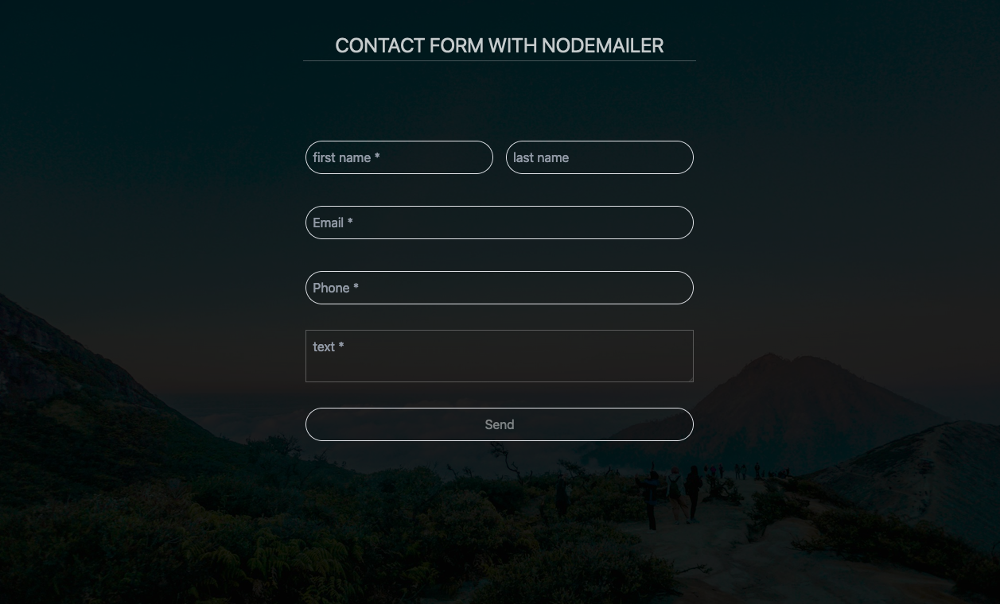

## Contact form with Nodemailer

### Technologies used

- JavaScript
- TypeScript
- Node.JS
- Express.js
- React
- Tawilwind CSS

### Live Demo

- Netlify: https://nodemailer-form-by-farhad.netlify.app
<p>Note: This live demo is not connected to the backend server, so email won't deliver.</p>


### Preview


### Getting Started

##### Installation:

**Clone the repository**:

```bash
git clone https://github.com/farhadxf/contact-form-nodemailer.git

```

#### dependencies:

```bash
cd client
```

<button onclick="navigator.clipboard.writeText('cd client')"></button>

- **npm:**

  ```bash
  npm install
  ```

  <button onclick="navigator.clipboard.writeText('npm install')"></button>

- **yarn:**
  ```bash
  yarn install
  ```
  <button onclick="navigator.clipboard.writeText('yarn install')"></button>

**Start the development server:**

- **npm:**

  ```bash
  npm run dev
  ```

  <button onclick="navigator.clipboard.writeText('npm run dev')"></button>

- **yarn:**
  ```bash
  yarn dev
  ```
  <button onclick="navigator.clipboard.writeText('yarn dev')"></button>

**backend server:**

```bash
cd backend
```

<button onclick="navigator.clipboard.writeText('cd backend')"></button>

**start the server:**
**backend server:**

```bash
npm start
```

<button onclick="navigator.clipboard.writeText('npm start')"></button>

#### Author

- [Farhad Hossen](https://farhadx.com)

#### License

This project is open source and available under the [MIT License](LICENSE)
